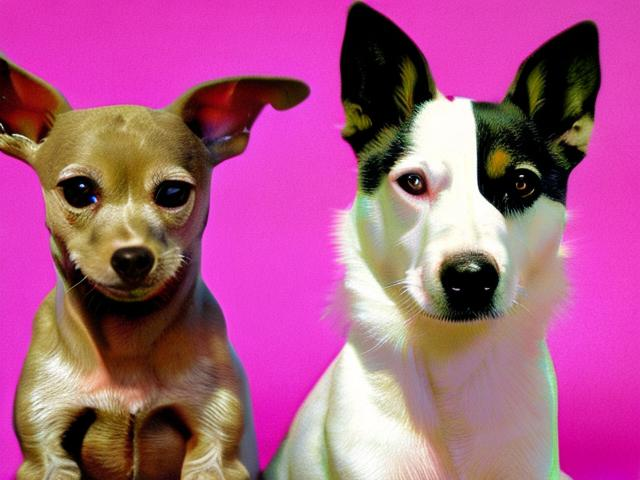

# repro-stable-diffusion-v2
Stable Diffusion v2, high-resolution image synthesis with latent diffusion models, This stable-diffusion-2 model is resumed from stable-diffusion-2-base (512-base-ema.ckpt) and trained for 150k steps using a v-objective on the same dataset.

## 1. Install helper

**Please check your nvcc version and cuda version >= 11.7**

```bash
nvcc -V
nvidia-smi
```

**environment building**

```bash
# create a new conda environment
conda activate --name sd2 python=3.9
conda activate sd2

# Install the following packages in order
pip install diffusers==0.16.0
pip install Pillow==10.3.0
pip install Requests==2.31.0
pip install torch==1.13.1+cu117 torchvision==0.14.1+cu117 torchaudio==0.13.1 --extra-index-url https://download.pytorch.org/whl/cu117
```

## 2. How to use

### 2.1 Download Pre-trained Files

Download Stable Diffusion v2's pre-trained files [here](https://huggingface.co/stabilityai/stable-diffusion-2).

### 2.2 Just try it!

Modify the text prompts and image in ``example.py`` and then run the following command.

```bash
CUDA_VISIBLE_DEVICES=0 python example.py
```

### 2.3 Reproducibility



